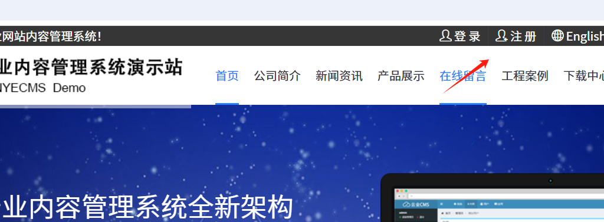
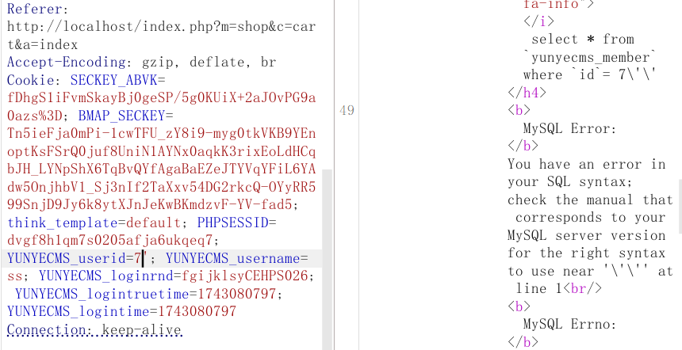
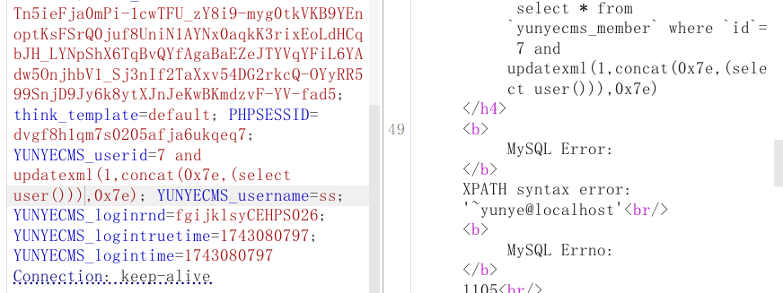
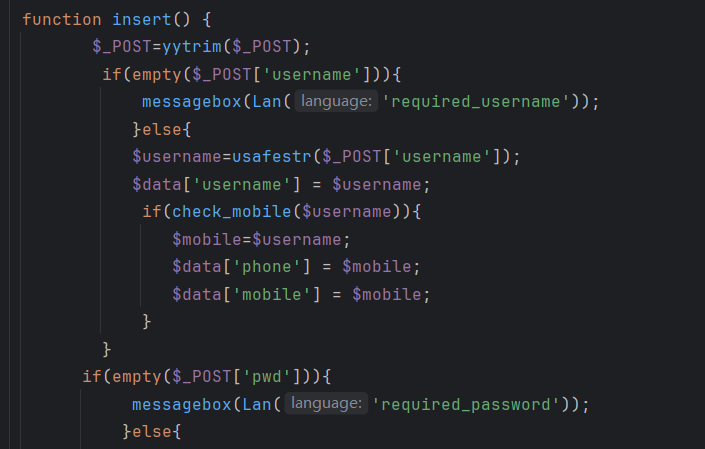

yuncms存在sql注入漏洞



首先前台注册一个普通账号，登录后抓包



在cookie里面的yunyecms_userid存在注入




扩充：

userid存在注入是否存在越权漏洞

验证：


userid=7  用户为ss


userid=6 用户为130--

存在越权，说明cookie中唯一验证的就是userid

排除杂质：


定位关键位置：cookie中的userid，通过抓包先定位到注册处

core/app/member/member.php register方法



首先利用yytrim过滤

```
function yytrim($string){
	if(is_array($string)){
		foreach($string as $key=>$var){
			$string[$key]=usafestr(trim($var));
		}
	  }else{
	$string=usafestr(trim($string));
	}
	return $string;
}
```

数组做一个循环去空，单个则去空直接进入usafestr函数过滤，继续跟进

```
function usafestr($string,$flitersql=1,$fliter_script=1) {
	$string=str_ireplace("%","",$string);
    $string = str_ireplace('%20','',$string);
    $string = str_ireplace('%27','',$string);
    $string = str_ireplace('%2527','',$string);
	$string=str_ireplace("\t","",$string);
    $string = str_ireplace('*','',$string);
    $string = str_ireplace("'",'',$string);
    $string = str_ireplace(';','',$string);
    //$string = str_replace("{",'',$string);
    //$string = str_replace('}','',$string);
	$string=str_ireplace("#","",$string);
	$string=str_ireplace("--","",$string);
	$string=str_ireplace("\"","",$string);
	$string=str_ireplace("/","",$string);
    $string = str_ireplace('\\','',$string);
	if($flitersql){
		$string=safestring::fliter_sql($string);
		}
	if($fliter_script){
		$string=safestring::fliter_script($string);
		}
	$string=safestring::fliter_escape($string);
	$string=htmlspecialchars($string);
	$string = str_ireplace("$", "&#36;", $string);
	$string = str_ireplace("\n", "<br/>", $string);	
	$string = str_ireplace('%','%&lrm;',$string);
	$string=addslashes($string);
    return $string;
}
```

这里针对输入的参数做了一些过滤，包括单引号等一些。

```
fliter_sql：
$sql = array("select", 'insert', "update", "delete","\'", "\/\*", 
     "\.\.\/", "\.\/", "union", "into", "load_file", "outfile","drop","modify","create","alter","exec","regxp");
$sql_re = array("","","","","","","","","","","","","","","","","","");
return str_ireplace($sql, $sql_re, $value);
}
```

回到member->设置好过滤之后依次做判断

成功会存储userid,username等，然后进入index/member/member，失败则返回

注册好之后进入登录，仍然是一样的过滤

登陆成功更新登陆时间，指向index/member/member

进入myinfo，会判断是否登录。

```
  function islogin(){
        $userid=ugetcookie("userid");
		if(empty($userid)){
	         messagebox('您还没有登录! ',url('login/member/member'));	 
		}
	}
```

所以全局就依靠userid判断是否登录

获取cookie中的userid，然后将登录信息赋值

```
islogin();
		$userid=ugetcookie("userid");
```

继续跟踪，ugetcookie并未做任何过滤操作。

```
$member=$this->member;
```

跟进member，member是一个公共的公共属性，userid存在时

```
if($userid){
		    $this->member=getbyid($userid,"member");
		    $this->member['cartnum']=getcount("select count(*) from `#yunyecms_cart` where userid={$this->member["id"]}");
		    $this->member['ordernum']=getcount("select count(*) from `#yunyecms_orders` where userid={$this->member["id"]}");
		    $this->member['noticenum']=getcount("select count(*) from `#yunyecms_notice` where status=1");
		}
```

会重新赋值到member，跟进getbyid

```
function  getbyid($id,$tablename='category'){
	    if(empty($id)) {
			return false;
		}else{
		 $strsql="select * from `#yunyecms_{$tablename}` where `id`= {$id}";
		 $catarr=getone($strsql);
		 if(empty($catarr)){
			 return false;
		  }else{
			 return $catarr;
			  }
		 }	 
	}
```

输入两个参数，$id=$userid,$tablename=member。首先进入else，$strsql="select * frim `#yunyecms_member` where  `id`={$userid}"

在跟进下getone

```
function getone($strsql,$db=array()) {
	 if(empty($db)) $db=core::load_model('common_model');
	 $datalist=$db->find($strsql);
	 return $datalist;
}
```

直接输出数组给到member。

```
 $userid=$curmember["id"];
```

也没有过滤


重新总结：

首先用户注册-用户登录-触发logincheck，验证账号密码后$curmember会输出当前用户属性的一行。

$userid被$curmember[id]赋值作为cookie中的一部分

$userid是登录校验的关键参数,利用ugetcookie方法获取cookie中的userid

设计了一个公共属性member(存储用户的信息)，如果userid存在，这个member被getbyid($userid,"member")赋值，也就是表在这里固定为member，默认为category

跟进getbyid，这里没有过滤直接拼接然后输出。

```
$strsql="select * from `#yunyecms_{$tablename}` where `id`= {$id}"
```

