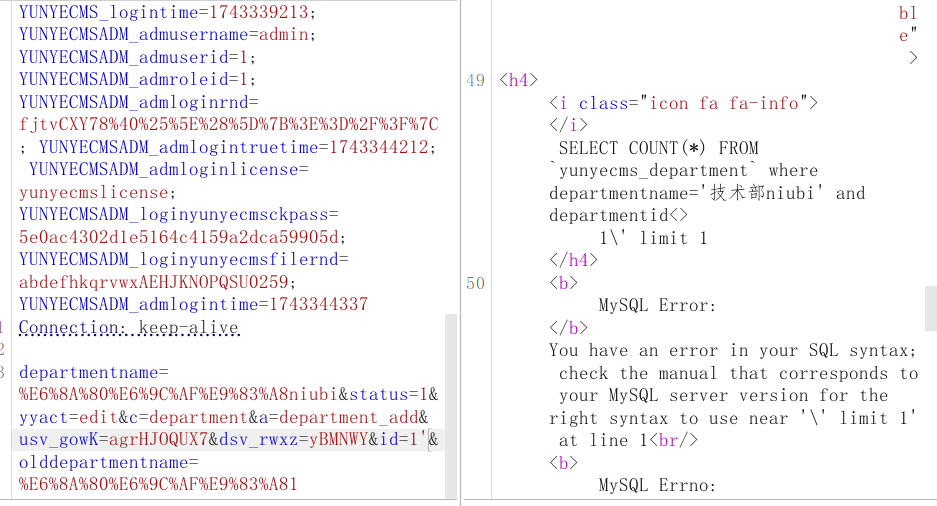

yunyecms后台存在sql注入漏洞


修改部门名字



id处存在注入


代码分析：

定位到core/admin/department.php

```
public function department_add(){
 if($_POST["yyact"]=="edit"){
			       $id=$_POST["id"];
			       $olddepartmentname=$_POST["olddepartmentname"];
				   $this->edit_admin_department($id,$departmentname,$olddepartmentname,$status);
			  }			  
```

直接从post接受一个id参数

```
if($departmentname!=$olddepartmentname){
			   $num=$this->db->GetCount("select count(*) as total from `#yunyecms_department` where departmentname='$departmentname' and departmentid<>$id limit 1")
```

会被输入到sql语句中


只需要更改的时候不重复名字即可

