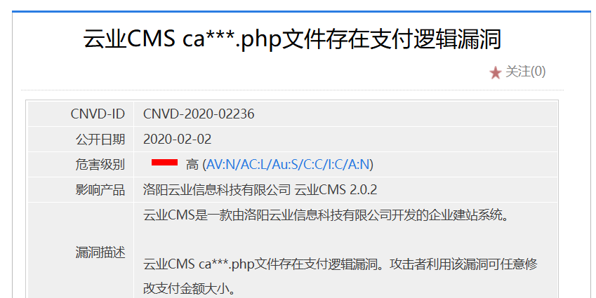
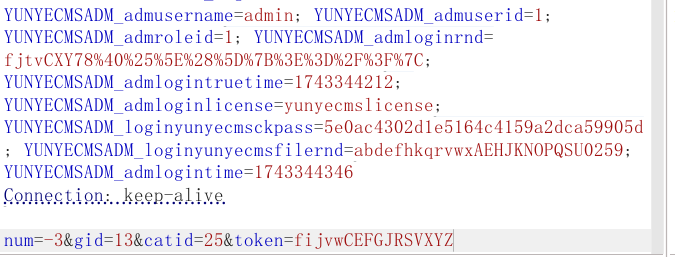
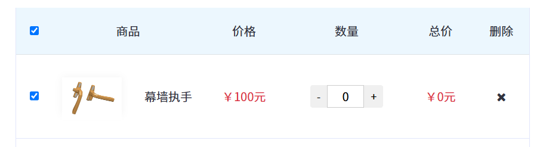

定位到该文件core/app/shop/cart.php

首先思考下，任意修改金额大小，那么肯定是金额计算时某个参数出现问题，或者本身金额可控。

抓包支付相关的几个数据包

```
POST /index.php?m=shop&c=cart&a=add HTTP/1.1
Host: 127.0.0.1
Content-Length: 45
Cache-Control: max-age=0
sec-ch-ua: "Not?A_Brand";v="99", "Chromium";v="130"
sec-ch-ua-mobile: ?0
sec-ch-ua-platform: "Windows"
Accept-Language: zh-CN,zh;q=0.9
Origin: http://127.0.0.1
Content-Type: application/x-www-form-urlencoded
Upgrade-Insecure-Requests: 1
User-Agent: Mozilla/5.0 (Windows NT 10.0; Win64; x64) AppleWebKit/537.36 (KHTML, like Gecko) Chrome/130.0.6723.70 Safari/537.36
Accept: text/html,application/xhtml+xml,application/xml;q=0.9,image/avif,image/webp,image/apng,*/*;q=0.8,application/signed-exchange;v=b3;q=0.7
Sec-Fetch-Site: same-origin
Sec-Fetch-Mode: navigate
Sec-Fetch-User: ?1
Sec-Fetch-Dest: document
Referer: http://127.0.0.1/index.php?a=show&catid=28&id=14
Accept-Encoding: gzip, deflate, br
Cookie: qebak_loginlangid=1; PHPSESSID=2s3tcto0ijbimh42ejdriomed2; YUNYECMS_userid=7; YUNYECMS_username=ss; YUNYECMS_loginrnd=fijvwCEFGJRSVXYZ; YUNYECMS_logintruetime=1743339213; YUNYECMS_logintime=1743339213; YUNYECMSADM_admusername=admin; YUNYECMSADM_admuserid=1; YUNYECMSADM_admroleid=1; YUNYECMSADM_admloginrnd=fjtvCXY78%40%25%5E%28%5D%7B%3E%3D%2F%3F%7C; YUNYECMSADM_admlogintruetime=1743344212; YUNYECMSADM_admloginlicense=yunyecmslicense; YUNYECMSADM_loginyunyecmsckpass=5e0ac4302d1e5164c4159a2dca59905d; YUNYECMSADM_loginyunyecmsfilernd=abdefhkqrvwxAEHJKNOPQSU0259; YUNYECMSADM_admlogintime=1743344346
Connection: keep-alive

num=1&gid=14&catid=28&token=fijvwCEFGJRSVXYZ
```

发现了num,gid,catid,token参数，定位金额

```
$goods=GetContentById($var["gid"],$var["catid"]);
				  $list[$key]["goods"]=$goods;
				  $list[$key]["goods"]["url"]=url('show/index/content',array("catid"=>$goods["catid"],"id"=>$goods["id"]));
				  $list[$key]["totalprice"]=round($var["num"]*$var["price"],2);
				  $list[$key]["price"]=round($var["price"],2);
```

gid是商品号,num是数量,然后还有个price单价，num*price=totalprice，也就是金额只跟这三个有关。

首先看num是如何操作的，add方法

```
  if(empty($_REQUEST['num'])){
	     $num=1;
		 }else{
	     $num=trim($_REQUEST['num']);
		 $num = intval(usafestr($_REQUEST['num']));
		 }
	     if(!empty($_REQUEST['gid'])){
		    $gid=$_REQUEST['gid'];
			if(!is_numeric($gid)){
		     messagebox(Lan('goodsid_is_notnum'));		
             }
		 }else{
		     messagebox(Lan('goods_parm_error'));		
		 }
```

为空时，默认为一。否则就从request获取过滤，跟进usafestr方法，包含了一些sql注入的过滤，以及确定num为整数

在装入购物车的时候抓包，修改num数值。当输入num为负数时,仍然是有效的数字





从而达到0元购
