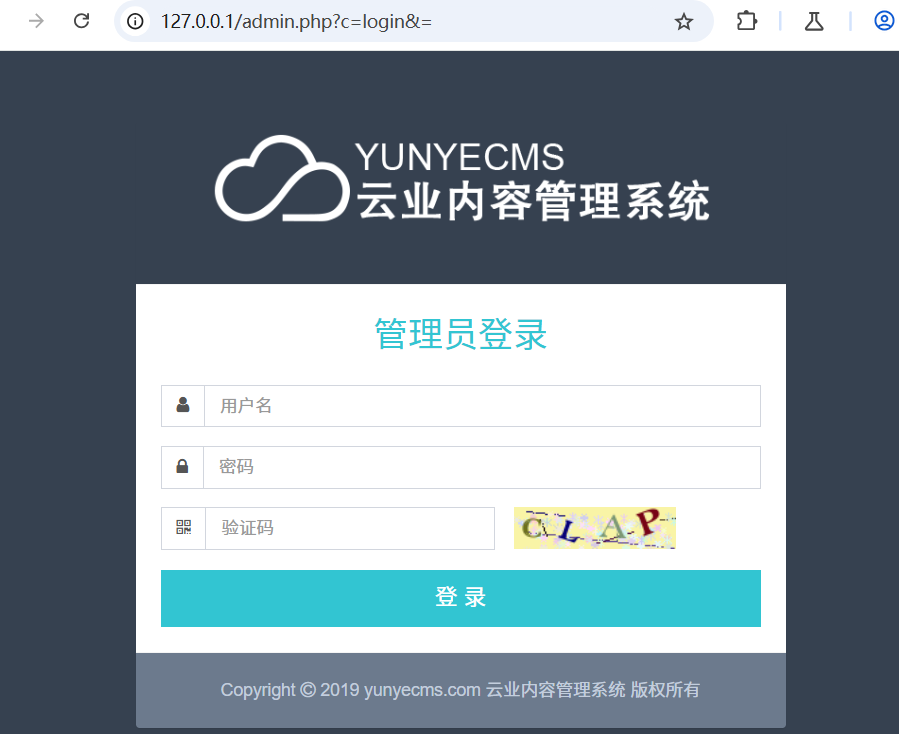
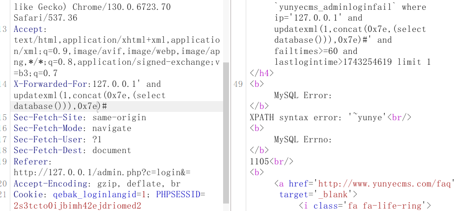

yunyecms存在sql注入漏洞





在获取ip处存在漏洞

代码分析：

定位core/admin/login.php的adminlogin方法

```
   private function adminlogin ($username,$password){
$logiparr["ipaddr"]=getip();
$logiparr["ipport"]=getipport();
```

会利用getip方法去获取ip地址，跟进方法

```
function getip(){
		if (isset($_SERVER['HTTP_CLIENT_IP']) && strcasecmp($_SERVER['HTTP_CLIENT_IP'], "unknown"))
			$ip = $_SERVER['HTTP_CLIENT_IP'];
		else if (isset($_SERVER['HTTP_X_FORWARDED_FOR']) && strcasecmp($_SERVER['HTTP_X_FORWARDED_FOR'], "unknown"))
			$ip = $_SERVER['HTTP_X_FORWARDED_FOR'];
		else if (isset($_SERVER['REMOTE_ADDR']) && strcasecmp($_SERVER['REMOTE_ADDR'], "unknown"))
			$ip = $_SERVER['REMOTE_ADDR'];
		else if (isset($_SERVER['REMOTE_ADDR']) && isset($_SERVER['REMOTE_ADDR']) && strcasecmp($_SERVER['REMOTE_ADDR'], "unknown"))
			$ip = $_SERVER['REMOTE_ADDR'];
		else $ip = "";
		return ($ip);
}
```

没有什么过滤，做了几个判断来获取ip

返回跟进$logiparr

```
 $this->CheckLoginTimes($logiparr["ipaddr"],$logintime);
```

跟进CheckLoginTimes方法

```
 private function CheckLoginTimes($ip,$time){
	$checktime=$time-60*ADMLOGIN_MINUTES;
	$cnt=$this->db->GetCount("select count(*) as total from `#yunyecms_adminloginfail`  where ip='$ip' and failtimes>=".ADMLOGIN_MINUTES." and lastlogintime>$checktime limit 1");
	if($cnt)
	{
	   messagebox(Lan('adminlogin_fails_time'),url_admin(),"warn");			
	}
   }		  
```

发现ip被直接拼接在sql语句中并未过多的过滤，导致了注入
