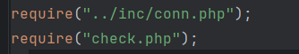
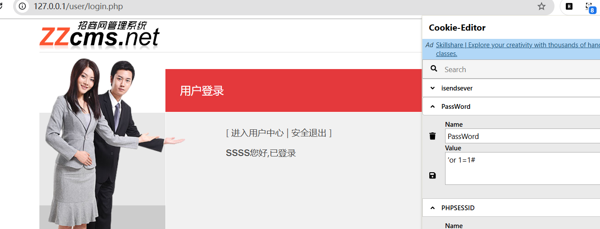

zzcmsv8.2存在前台SQL注入漏洞

通读框架,对admin,mannage,api,user,cron,inc等文件夹敏感

比如首先访问user/adv.php



包含了两个文件,inc下的一般是配置核心文件,check根据名字一般是过滤或者鉴权。那么我们就需要先看全局的过滤，然后在找关键函数方法

```
if (!isset($_COOKIE["UserName"]) || !isset($_COOKIE["PassWord"])){
echo "<script>location.href='/user/login.php';</script>";
}else{
$username=nostr($_COOKIE["UserName"]);
	$rs=query("select id,usersf,lastlogintime from zzcms_user where lockuser=0 and username='".$username."' and password='".$_COOKIE["PassWord"]."'");
	$row=num_rows($rs);
		if (!$row){
```

cookie验证中如果username和password不为空，就放入到sql语句中去执行，username会被nostr方法过滤，但是password并没有。

```
function nostr($str){
//strip_tags($str);
	$sql_injdata = "',/,\,<,>,�";
    $sql_inj = explode(",",$sql_injdata);
	for ($i=0; $i< count($sql_inj);$i++){
		if (@strpos($str,$sql_inj[$i])!==false){ 
		showmsg ("含有非法字符 [".$sql_inj[$i]."] 返回重填");
		}
	}
	return $str;//没有的返回值
}
```

可以构造万能密码'or 1=1#获取登录权限，这里是通用的，也就是存在check包含，则会存在sql注入问题。

